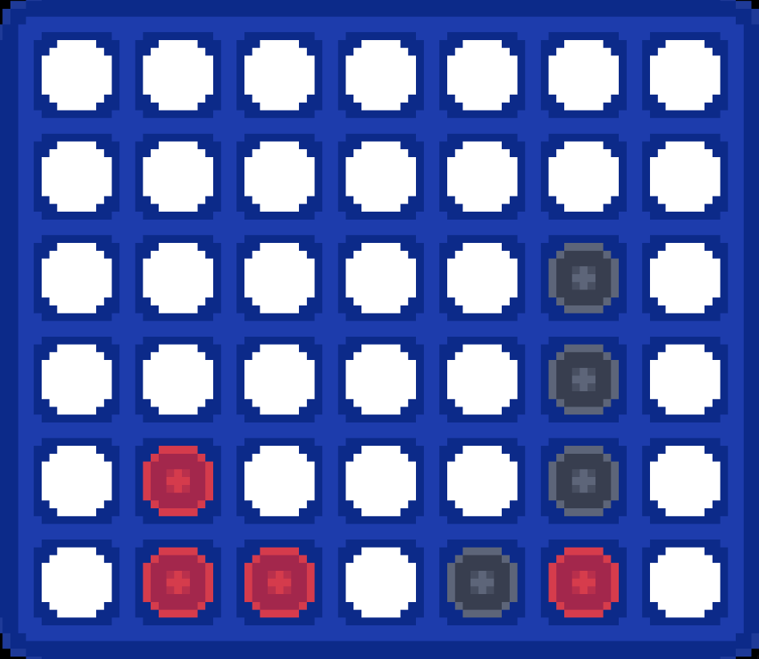
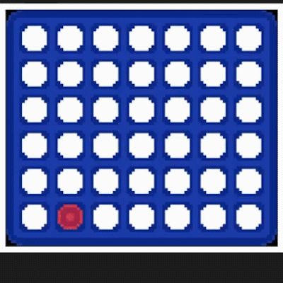
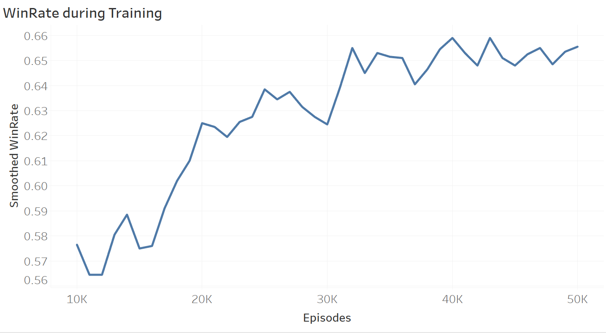

# Connect 4 RL

This project is about coding reinforcement learning approaches from scratch to solve the game of Connect 4.

  

The goal here is not performance, but to understand the fundamentals of reinforcement learning and how to implement them.

## DQN Approach

**This approach is a simple implementation of a Deep Q-Network (DQN) using Tensorflow. The DQN is trained against a random agent for 50 000 episodes and has a mediocre win rate of 68%.**

Here is DQN (in red) winning against a random agent (in black) by stopping the opponent's vertical tower before building his own.

  

Applying DQN on this environment is of course sub-optimal. The game is already solved and tree-search or minmax algorithms are much better suited for this task. However, this project is about understanding the fundamentals of reinforcement learning and how to implement them.

A few comments on this implementation of DQN:
- this implementation is very basic and limited
- it uses a replay buffer, an epsilon-greedy policy with epsilon decay, and a target network
- during the first attempts, the loss was diverging so we added soft updates to the target network
- the agent was trained on 50 000 episodes against the random agent

Here is the smoothed (10 000 episode average) win rate during training:

  

Here are some possible improvements:
- Currently training takes too much time: 6 hours on an RTX 3070 for 50 000 episodes
- Adding parallel training or other optimizations could help
- Adding Wandb logging could help to monitor and debug training
- Adding some form of reward shaping (e.g. giving a reward aligning pieces) could help the agent learn faster
- Choosing a better architecture and hyperparameters could help (a CNN could see winning patterns on the board)

The `dqn.py` file contains:
- a wrapper class for the Petting Zoo Connect 4 environment
- two baseline agents classes (random and leftmost legal)
- a DQN agent class entirely coded from scratch using only Tensorflow
- a training loop with epsilon, loss and mean reward logging
- an evaluation function
